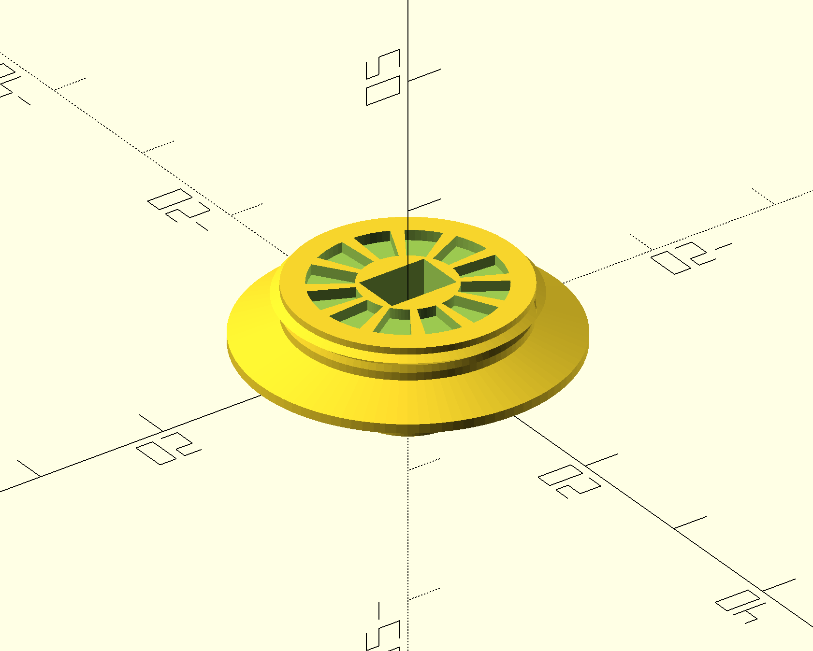
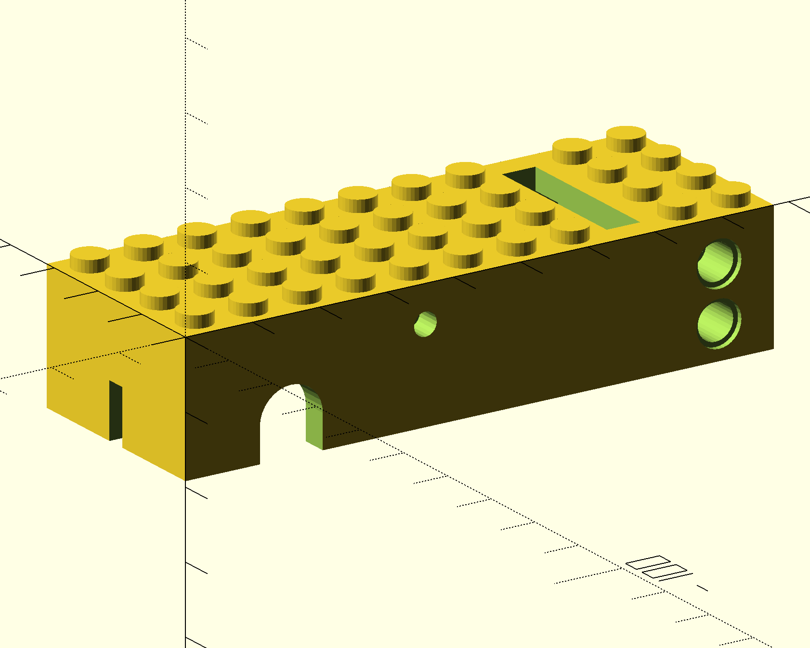

# Lego compatible train motor
OpenSCAD models for 3D-printable, LEGO-compatible train parts:
train wheels and a motor frame. The motor itself uses a TT motor which can be bought online easily.

## Train wheel
`trainwheel.scad` models the wheel that ships on the 9V/PF LEGO train motor
("Train Wheel RC, Spoked with Technic Axle Hole and Rubber Friction Band",
[BrickLink 55423c01](https://www.bricklink.com/v2/catalog/catalogitem.page?P=55423c01)).

## Motor frame
`frame.scad` models a frame that goes around a TT motor, resulting in a LEGO-compatible train motor. The front axle is the TT motor's own axle, onto which you attach two train wheels. At the back there is a hole in which you put a regular LEGO axle and some train wheels. If you don't currently have any train wheels, or need more, you can print `trainwheel.scad` with the regular LEGO axle option enabled.

